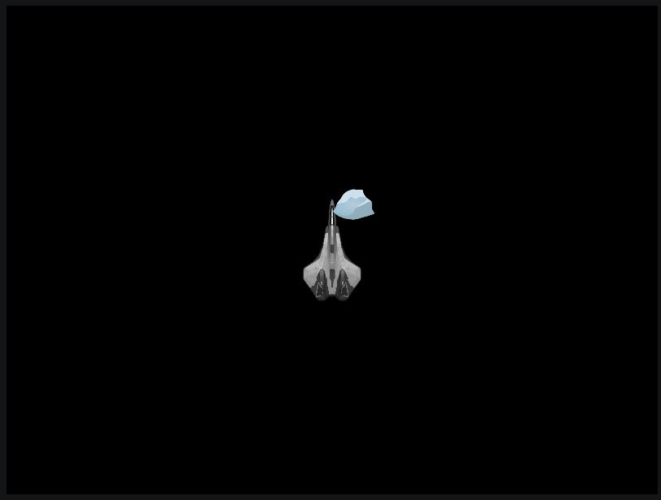

<style>
/* Studying vs Working */
.explanation {
  color: darkorange;
}
.action {
  color: red;
}

/* Only appear to the teacher */
.teacher {
  background-color: #c49816;
}

/* Tags */
.vocabulary {

}
.exercice {

}


</style>

<script>
  function docReady(fn) {
    // see if DOM is already available
    if (document.readyState === "complete" || document.readyState === "interactive") {
        // call on next available tick
        setTimeout(fn, 1);
    } else {
        document.addEventListener("DOMContentLoaded", fn);
    }
}

docReady(() => {
  const array = Array.from(document.querySelectorAll('.explanation'));
  array.forEach(e => e.addEventListener('click', () => {console.log(123)}));

  const teacher = document.querySelector('#teacher');
  teacher.addEventListener('change', e => console.log(e.target.checked));
});
</script>

# Introduction

This is a tutorial will guide you for making your first game with [pixijs](https://github.com/pixijs/pixi.js). It is intended for people never having made a game, but that have some basics in programming. The objective is to give you essential/key notions about game programming, so that you are able to make your own game afterward.

Each step is tagged, click on the title to get to the state of the code at start of this step.

# Pre-requisites

NodeJS installed.
Your preferred IDE installed, Webstorm or Visual Studio Code recommended.


## Choose your reading style

<fieldset>
  <legend>I am</legend>

  <input type="radio" name="Iam" id="student" checked>
  <label for="student">Student</label><br/>

  <input type="radio" name="Iam" id="teacher">
  <label for="teacher">Teacher (additionnal content, relevant for teaching this learning material)</label>
</fieldset>

<fieldset>
  <legend>Explanation quantity</legend>
<b></b>
  <input type="radio" name="learning-style" id="studying" checked>
  <label for="studying">I want all available explanations, I like to understand everything. (<b>recommended</b>, <b>verbose</b>)</label><br/>

  <input type="radio" name="learning-style" id="working">
  <label for="working">I want to make it work <b>fast</b>. The less explanations there is, the better.</label>
</fieldset>

<fieldset>
  <legend>Coding simplicity/quality balance</legend>
  <input type="radio" name="balance" id="quality" checked>
  <label for="quality">I want my code to favor best pratices. (<b>recommended</b>) (<b>webpack, typescript, npm</b>)</label><br/>

  <input type="radio" name="balance" id="simplicity">
  <label for="simplicity">I want to keep my code as simple as possible. (<b>CDN install, pure JS</b>)</label>
</fieldset>


# Summary

[TOC]


## 0. Setup project

You can skip the project setup if you cannot install nodeJS on you environment (like no admin right) by using https://www.pixiplayground.com/#/edit. However you will need to adapt the code yourself.


<div class="explanation vocabulary" markdown>

[Canvas HTML tag][0]: 
  - Use the HTML canvas element with either the `<canvas>` scripting API or the WebGL API to draw graphics and animations.
  - Not to be confused with the canvas API.
  - It define the zone on the webpage that will be available for pixijs to use.

[Canvas API][1]: 
  - The Canvas API provides a means for drawing graphics via JavaScript and the HTML `<canvas>` element. Among other things, it can be used for animation, game graphics, data visualization, photo manipulation, and real-time video processing.
  - Not to confuse with canvas html tag.

[WebGL API][2]: 
  - WebGL (Web Graphics Library) is a JavaScript API for rendering high-performance interactive 3D and 2D graphics within any compatible web browser without the use of plug-ins.

[Canvas vs WebGL API][3]:
  - The Canvas API largely focuses on 2D graphics. The WebGL API, which also uses the `<canvas>` element, draws hardware-accelerated 2D and 3D graphics. 
  - With a library, always prefer WebGL, and you should use a library. You can try canvas or webgl api for curiosity though.
  - WebGL API recent then canvas API.
  - WebGL API performant then canvas API.
  - WebGL API is harder to use then canvas API.

[PixiJs][4]:
  - PixiJS is a rendering library that will allow you to create rich, interactive graphics, cross platform applications, and games without having to dive into the WebGL API or deal with browser and device compatibility.

</div>

<div class="reference" markdown>
[0]: https://developer.mozilla.org/en-US/docs/Web/HTML/Element/canvas
[1]: https://developer.mozilla.org/en-US/docs/Web/API/Canvas_API
[2]: https://developer.mozilla.org/en-US/docs/Web/API/WebGL_API
[3]: https://stackoverflow.com/questions/21603350/is-there-any-reason-for-using-webgl-instead-of-2d-canvas-for-2d-games-apps
[4]: https://github.com/pixijs/pixi.js
</div>

<div class="do" style="font-size: larger;" markdown>

/!\ [It is recommended you skip the following part](#1-setup-scene) /!\

</div>


### 0.1 (one file) CDN install

<div class="explanation" markdown>

You can use a [CDN](https://github.com/pixijs/pixi.js?utm_source=html5weekly#cdn-install-via-cdnjs) install, instead of npm and typescript. It is good to know, it can be as simple as that.

</div>

<div class="do" markdown>


src/index.html
```html
<!DOCTYPE html>
<html lang="en">
<head>
  <meta charset="UTF-8">
  <title>Title</title>
</head>
<body>
  <script src="https://cdnjs.cloudflare.com/ajax/libs/pixi.js/5.1.3/pixi.min.js"></script>
  <script>
    console.log(PIXI);
  </script>
  <!-- OR make an index.js file in the same folder -->
  
</body>
</html>
```

Replace `5.1.3` by latest available version. You can also replace

```html
  <script>
    console.log(PIXI);
  </script>
```

by

```html
<script src="index.js"></script>
```

</div>


### 0.2 Npm/ts/webpack install

#### Npm and Typescript

Note that it will be up to you, to decide when to commit.

<div class="do" markdown>

```sh
cd pixijs-first-game/
git init
touch .gitignore

# Webstorm IDE
echo .idea/ >> .gitignore
echo node_modules/ >> .gitignore
# Build folder
echo dist/ >> .gitignore

npm init -y
npm i --save pixi.js 
npm i --save-dev typescript


# create tsconfig.json
tsc --init
```

Change your `tsconfig.json` to (you can keep commented line):
```json
{
  "compilerOptions": {
    "target": "ESNEXT",
    "module": "ESNext",
    "lib": [
      "dom",
      "dom.iterable",
      "esnext"
    ],
    "sourceMap": true,
    "strict": true,
    "moduleResolution": "node",
    "esModuleInterop": true
  }
}
```

/!\ Commented lines in tsconfig does not show defaults values. This can be misleading.

**target, module**  
We want to work with the latest technology available (but losing in compatibility with old browsers).

**lib**  
We have to add necessary library to work with the browser ans ESNext.

**sourceMap**  
This allow the browser to map outputted JS code to original TS code. Helpful for debugging, but this expose your sources in the final product.

**outDir**  
Where we want our Typescript to compile. Default typescript config output JS file rightn ext to TS files. We do not need it, because we will be using webpack.

**strict**  
Add a couple of rules making the typing system stricter.

**esModuleInterop**
\-

**moduleResolution**  
This look like it should be default, but if you do not decomment this line, Typescript will not find `pixijs` module when trying to import it.

**include** 
We do not need this option, because we will be using webpack. Without webpack, it would allow us, to limit compilation to `src` folder.


Create the files and directory as bellow:
```sh
mkdir src
touch src/index.html
touch src/index.ts
```

</div>

<div class="do" markdown>


src/index.html
```html
<!DOCTYPE html>
<html lang="en">
<head>
  <meta charset="UTF-8">
  <title>Title</title>
</head>
<body>
    <script src="bundle.js" type="module"></script>
</body>
</html>
```

src/index.ts
```ts
import * as PIXI from 'pixi.js';

// This should not log undefined.
console.log(PIXI);
```
</div>

#### Webpack

<div class="explanation" markdown>
To allow us to leverage npm packages, we need a javascript bundler. We will be using webpack.
</div>

<div class="do" markdown>

```sh
npm i -D ts-loader webpack webpack-cli
touch webpack.config.js
```

webpack.config.js
```js
module.exports = {
  mode: "development",
  devtool: "inline-source-map",
  entry: "./src/index.ts",
  output: {
    filename: "bundle.js"
  },
  resolve: {
    // Add `.ts` and `.tsx` as a resolvable extension.
    extensions: [".ts", ".tsx", ".js"]
  },
  module: {
    rules: [
      // all files with a `.ts` or `.tsx` extension will be handled by `ts-loader`
      { test: /\.tsx?$/, loader: "ts-loader" }
    ]
  }
};
```
@See https://github.com/TypeStrong/ts-loader#configuration
@See https://webpack.js.org/guides/getting-started/


You can add a npm script in `package.json` to build:
```json
{
  "scripts": {
      "build": "webpack"
  }
}
```


If you build now, you will end up with a `bundle.js` inside `dist` folder, that is not useful without our `index.html`...
```sh
npm run build
```

Note that webpack does not clean your `dist` folder before building. This is not an issue as it will override needed files anyway. On linus you could replace above npm script with `rm -rf ./dist && npm run build`. I don't remember how you can do it on windows. You can also, most probably do it trough webpack configuration.

@See https://github.com/webpack/webpack-dev-server
@See https://webpack.js.org/configuration/dev-server/#devserver
</div>

<div markdown>

We gonna add our `index.html` to the webpack output.

Add `file-loader` package.
```sh 
npm i -D file-loader
```

In `index.ts` add `import './index.html';`, so that it is added by webpack in dist.

In webpack config, add:
```js
module.exports = {
  module: {
    rules: [
      {
        test: /\.html/,
        loader: 'file-loader',
        options: {
          name: '[name].[ext]',
        }
      },
    ]
  }
}
```

Build and check that `index.html` is put inside `dist` foler.
```sh
npm run build
```

However, if you try to open the `dist/index.html`, you will be blocked by CORS (Cross origin request security). If you are using Webstorm, you can right click on the file and click `run 'index.html'`. When opening the console you should see a log starting with `Object {`. Another way would be to make a webserver in nodejs (using `http-server` package for example), to serve `index.html` without CORS issues.
There is a more practical way of viewing our code in development, using `webpack-dev-server` package.
</div>

#### Webpack dev server

Install the package.
```sh
npm i -D webpack-dev-server
```

In `package.json` add:
```json
{
  "scripts": {
      "start": "webpack-dev-server",
  }
}
```

```sh
npm run start
```
This will create a server watching your file and live reloading your webpage on change.

Open `http://localhost:8080/`, and check your console that you have a log that is not undefined. Should start with `Object {`.

## [1. Setup stage](https://github.com/ambroiseRabier/pixijs-first-game-tutorial/tree/1-setup-stage)

The stage, or scene as it is called in Unity, is the main container of the game.

If you have skipped the previous part, download the project with:

```sh
git clone --branch 1-setup-stage git@github.com:ambroiseRabier/pixijs-first-game-tutorial.git
```

---

Create the scene/stage, you `index.ts` should be:
```ts
import './index.html';
import {Application} from 'pixi.js';


// The application will create a renderer using WebGL, if possible,
// with a fallback to a canvas render. It will also setup the ticker
// and the root stage PIXI.Container
const app = new Application();

// The application will create a canvas element for you that you
// can then insert into the DOM
document.body.appendChild(app.view);
```

Auto-import on my IDE give me `import Application = PIXI.Application;`, instead of better looking named exports. I guess this is an issue with pixiJS.


You can personalize the scene:
```ts
const app = new Application({
  backgroundColor: 0x567d00,
  // width, height, ...
});
```


## [2. Display a sprite](https://github.com/ambroiseRabier/pixijs-first-game-tutorial/tree/2-display-sprite)

<div class="explanation" markdown>

  Sprite: todo: show the inheritance shema, the base object is some kind of transform like in unity. sprite have some method in bonus. It is used to display a visual (spritesheet too right?).

</div>

<div class="explanation" markdown>

You could create an `assets` folder, it allow to decuple the hierarchy of your code directory form the hierarchy directory of the `assets`. This can be useful to allow your game artist to just organize himself however he like, and quickly update the assets without having any conflicts, with the way developers organize their code. If you are both game artist and developer, like on this tutorial, it will be easier to have only one directory hirearchy.

There is plenty of free assets you can find on the internet, you should be looking into conditions of use, licence before using them. Especially if you make money out of your game, or if you publish your game openly on the internet.

Mixing the tests, assets and scripts together is frequent nowadays, it is a angular2+ guidelines by the way. It make thing easier to find and to scale.

If you want to proceed in that way and you work with a game artist, make sure to communicate with him.

</div>

I will be using this png for my character:
https://www.pinclipart.com/pindetail/obJhJJ_svg-royalty-free-library-fighter-clipart-spaceship-spaceship/#

Download and rename it `spaceship.png`, put it in `src` folder.

Webpack need to be configured to add images in the `dist` folder.

Add to `webpack.config.js`:
```js
module.exports = {
  module: {
    rules: [
      {
        test: /\.(jpe?g|png|gif|svg)$/i,
        loader: 'file-loader',
        options: {
          name: '[name].[ext]',
        }
      }
    },
  ]
}
```

<div class="explanation" markdown>

A little explanation on `name: '[name].[ext]'`, because `[path]` is missing, image that are in `src` folder will be in `dist` folder instead of `dist/src` folder. It is fine for this tutorial, but you have a file with the same name and extension in different folder, I suppose this would conflict. You can find the necessary informations in the documentation or internet if this happen to you later.

</div>


For webpack to add the image into the `dist` folder, it need to be used somewhere, add `import './spaceship.png';` inside `index.ts`. `spaceship.png` will appear in `build/dist` when running `npm run build`. Unused file are not bundled automatically, handy.

Restart your development server (`npm start`), and open http://localhost:8080/spaceship.png, you should see the image.

We can make this better, change your `index.ts` so that you have:
```ts
import './index.html';
import {Application, Sprite} from 'pixi.js';
import spaceship from './spaceship.png';

// The application will create a renderer using WebGL, if possible,
// with a fallback to a canvas render. It will also setup the ticker
// and the root stage PIXI.Container
const app = new Application();

// The application will create a canvas element for you that you
// can then insert into the DOM
document.body.appendChild(app.view);

app.stage.addChild(Sprite.from(spaceship));
```

`spaceship` will have for value a string containing the path to the file. If it doesn't find it, you get an error at compile time, instead of discovering it in game.

Typescript will complain `Cannot find module './spaceship.png'`, let's fix that:
Add a file named `global.d.ts` in `src` with content:
```ts
declare module "*.jpg" {
  const value: string;
  export default value;
}

declare module "*.png" {
  const value: string;
  export default value;
}
// you can add more when needed
```


<div class="explanation" markdown>

`.d.ts` file are typings information only files. Wht we have added allow Typescript to know that this kind of import is ok. To be clear, you could have added on the line above the import `// @ts-ignore`, and it would still have worked.

</div>


@Src https://stackoverflow.com/questions/37671342/how-to-load-image-files-with-webpack-file-loader
@Src https://stackoverflow.com/questions/36148639/webpack-not-able-to-import-images-using-express-and-angular2-in-typescript
@Src https://webpack.js.org/loaders/file-loader/


## [3. Fixing sprite](https://github.com/ambroiseRabier/pixijs-first-game-tutorial/tree/3-fixing-sprite)

We want to resize the sprite, and turn it 90°. Best would be to have the image fixed by the game artist. This allow him to keep full control of his assets, and have a correct feedback over what how his work look in game.
We are doing it for pedagogic purpose.

index.ts
```ts
import './index.html';
import {Application, Sprite, Point} from 'pixi.js';
import spaceshipPng from './spaceship.png';


// The application will create a renderer using WebGL, if possible,
// with a fallback to a canvas render. It will also setup the ticker
// and the root stage PIXI.Container
const app = new Application();

// The application will create a canvas element for you that you
// can then insert into the DOM
document.body.appendChild(app.view);

const player = Sprite.from(spaceshipPng);

// Setup the position of the sprite
player.x = app.renderer.width / 2;
player.y = app.renderer.height / 2;

// Rotate around the center
player.anchor.x = 0.5;
player.anchor.y = 0.5;

// Use radian, not degrees.
player.rotation = -Math.PI /2;
player.scale = new Point(0.15, 0.15);


app.stage.addChild(player);
```
@Src https://github.com/pixijs/pixi.js?utm_source=html5weekly#basic-usage-example

`anchor` property i used for as roation center. Rotation is in radian, not degree. You can also note that the sprite is a bit to detailed for the small size I have given it.

You can make a function to make it a bit cleaner.
```ts
function createPlayer(): Sprite {
  let _player = Sprite.from(spaceshipPng);

  // Setup the position of the sprite
  _player.x = app.renderer.width / 2;
  _player.y = app.renderer.height / 2;

  // Rotate around the center
  _player.anchor.x = 0.5;
  _player.anchor.y = 0.5;

  // Use radian, not degrees.
  _player.rotation = -Math.PI /2;
  _player.scale = new Point(0.15, 0.15);

  return _player;
}

const player = createPlayer();
```


## [4. Gameloop](https://github.com/ambroiseRabier/pixijs-first-game-tutorial/tree/4-gameloop)

```ts
app.ticker.add(() => {
  // each frame we spin the bunny around a bit
  sprite.rotation += 0.01;
});
```
@Src https://github.com/pixijs/pixi.js?utm_source=html5weekly#basic-usage-example

There is also `requestAnimationFrame` and `setInterval`. Pixijs Ticker class is using the first one underhood.


## [5. Inputs](https://github.com/ambroiseRabier/pixijs-first-game-tutorial/tree/5-inputs)

You can remove `sprite.rotation += 0.01;`, we won't need it.

Here is a simple example:
```ts
window.addEventListener('keydown', (event: KeyboardEvent) => {
  if (event.key === 'ArrowUp') {
     player.position.y -= 25;
  }
});
```

`'keydown'` is the first event of a key. It iscalled right when you start pressing the key. 


<div class="exercice" markdown>
 
Time for some exercice. How would you make the sprite move only when you press up?
There are tips bellow, do not hesitate to use them, it is up to you, how much self-discovery you want. What is important, is not to find the solution by yourself, but to be able to reproduce this solution later.


<details  class="tip" mardown>
  <summary>Tip 1</summary>

You are going to need `'keyup'` event:
```ts
window.addEventListener('keyup', (event: KeyboardEvent) => {
  if (event.key === 'ArrowUp') {
  }
});
```

</details>

<details  class="tip" mardown>
  <summary>Tip 2</summary>

You need to use the gameloop.
```ts
app.ticker.add(() => {

});

window.addEventListener('keydown', (event: KeyboardEvent) => {
  if (event.key === 'ArrowUp') {
  }
});

window.addEventListener('keyup', (event: KeyboardEvent) => {
  if (event.key === 'ArrowUp') {
  }
});
```

</details>

<details  class="tip" mardown>
  <summary>Tip 3</summary>

You need a playerSpeed variable.
```ts
let playerSpeed: Point = new Point(0,0);

app.ticker.add(() => {

});

window.addEventListener('keydown', (event: KeyboardEvent) => {
  if (event.key === 'ArrowUp') {
  }
});

window.addEventListener('keyup', (event: KeyboardEvent) => {
  if (event.key === 'ArrowUp') {
  }
});
```

</details>

<details  class="solution" mardown>
  <summary>Solution</summary>

```ts
let playerSpeed: Point = new Point(0,0);

app.ticker.add(() => {
  player.position.x += playerSpeed.x;
  player.position.y += playerSpeed.y;
});

window.addEventListener('keydown', (event: KeyboardEvent) => {
  if (event.key === 'ArrowUp') {
    playerSpeed = new Point(0,-1);
  }
});

window.addEventListener('keyup', (event: KeyboardEvent) => {
  if (event.key === 'ArrowUp') {
    playerSpeed = new Point(0,0);
  }
});
```

</details>

</div>


<div class="explanation" markdown>

Notice that:
- If you later happen to code a one time action on a key event, keep in mind to use `keydown` and not `keyup`, to react as fast as possible to the user.
- You may have found out that keeping you key pressed, will, after a short time, be spamming `keydown` event.

</div>


## [6. Multiple inputs](https://github.com/ambroiseRabier/pixijs-first-game-tutorial/tree/6-multiple-inputs)

<div class="exercice" markdown>

Now let's make the character able to move in 4 directions. You can also chose to add diagonal inputs, 8 directions.
You will need:
- 'ArrowUp'
- 'ArrowDown'
- 'ArrowLeft'
- 'ArrowRight'


<details  class="tip" mardown>
  <summary>Tip 1</summary>

You should keep track of what keys are currently pressed.
```ts
const keysPressed: {[key: string]: number}  = {
  'ArrowUp': 0,
  'ArrowDown': 0,
  'ArrowLeft': 0,
  'ArrowRight': 0
};
```
There is a practical reason to store what keys are pressed, as number (0 or 1), instead of boolean (false or true).

</details>

<details  class="tip" mardown>
  <summary>Tip 2</summary>

Here is how you make use of the previous dictonnary we made.
```ts
window.addEventListener('keydown', (event: KeyboardEvent) => {
  keysPressed[event.key] = 1;
});

window.addEventListener('keyup', (event: KeyboardEvent) => {
  keysPressed[event.key] = 0;
});
```

</details>

<details  class="solution" mardown>
  <summary>Solution</summary>


```ts
let playerSpeed = new Point();

const keysPressed: {[key: string]: number}  = {
  'ArrowUp': 0,
  'ArrowDown': 0,
  'ArrowLeft': 0,
  'ArrowRight': 0
};


// Listen for frame updates
app.ticker.add(() => {
  playerSpeed = new Point(
      keysPressed['ArrowRight'] - keysPressed['ArrowLeft'],
      keysPressed['ArrowDown'] - keysPressed['ArrowUp']
  );
  // each frame we spin the bunny around a bit
  player.position.x += playerSpeed.x;
  player.position.y += playerSpeed.y;
});


window.addEventListener('keydown', (event: KeyboardEvent) => {
  keysPressed[event.key] = 1;
});

window.addEventListener('keyup', (event: KeyboardEvent) => {
  keysPressed[event.key] = 0;
});
```

</details>

</div> 

<div class="explanation" markdown>

You may notice that if you keep pressed 3 arrow keys, and press the fourth one, the eventi s not triggered, this is probably not an issue with your code:
https://stackoverflow.com/questions/18155457/javascript-keydown-event-not-triggered-when-multiple-keys-are-held-down

You can check for yourself with this snippet:
```ts
  if (Object.values(keysPressed).reduce((a,b) => a+b) == 4) { // 3 is ok, but 4 will not appear with arrow keys
    console.log('4 keys pressed regitered');
  }
```

You could set up a speed multiplier to make the player faster or slower.

</div>


## [7. Spawn obstacle](https://github.com/ambroiseRabier/pixijs-first-game-tutorial/tree/7-spawn-obstacle)

<div class="exercice" markdown>

You can use what you have learned at [step 2](#2-display-sprite) to display an obstacle on stage (not on the player).

You can get the image [here](https://github.com/ambroiseRabier/pixijs-first-game-tutorial/blob/b8b7eec78d27f0b3b65cdf4eb665abac821a6f44/src/rock.png), the asset is free for personal use.

<details  class="solution" mardown>
  <summary>Solution</summary>

```ts
import obstaclePng from './obstacle.png';

function createObstacle(): Sprite {
  let _obstacle = PIXI.Sprite.from(obstaclePng);
  _obstacle.position = new Point(app.renderer.width/2, 0);
  return _obstacle;
}

const obstacle = createObstacle();
app.stage.addChild(obstacle);
```
</details>

</div>


## [8. Refractor obstacle](https://github.com/ambroiseRabier/pixijs-first-game-tutorial/tree/8-refractor-obstacle)

<div class="explanation" markdown>

A little information on PixiJS inherintance shema. I haven't found a shema of pixiJS inheritance shema (if someone find one, I would add it here). But it is quite similar to Flash:

(todo, make a copy of the file locally)


By looking into the source (ctrl-b on Webstorm on Sprite class). You can find out that:

PIXI.Sprite <- PIXI.Container <- PIXI.DisplayObject

Note that DisplayObject is an abtract class.

</div>

Let's separate obstacle code into his own file.

```sh
touch src/obstacle.ts
```

src/obstacle.ts
```ts
import {Point, Sprite, Container} from 'pixi.js';
import obstaclePng from './obstacle.png';

export class Obstacle {
  public readonly transform: Container = new Container();
  private readonly sprite: Sprite;

  constructor() {
    this.sprite = Sprite.from(obstaclePng);
    this.sprite.scale = new Point(0.3, 0.3);
    this.transform.addChild(this.sprite);
  }
}
```

Remove `createObstacle` function.

src/index.ts
```ts
const obstacle = new Obstacle();

obstacle.transform.position = new Point(app.renderer.width/2, 0);

app.stage.addChild(obstacle.transform);
```

Do not do `sprite.position = new Point(app.renderer.width/2, 0);`, this would also work, but gameplay related position changes will be applied to the `transform`, the `transform` has the position of the obstacle on the scene, and we do not want the position of the sprite to be `app.renderer.width/2` from his position. It might become easier to understand on the next step.

<div class="explanation" markdown>

This is slightly inspired from Unity. You could make use of inheriatnec `export class Obstacle extends Container` to allow you to do `app.stage.addChild(obstacle);`, this can be ok, but it will mix up your class Obstacle methods and fields with the Container methods and fields.
We could give in parameter the stage, to allow Obstacle to addChild the sprite on the stage, or just make sprite public field. But by making `transform` public, we allow the main script to addChild our obstacle, and our Obstacle to handle his internal state himself (addChild his sprite).
Note that there are more then one way to organize yourself.

</div>

<div class="exercice" markdown>
If you like, you can refractor the player the same way. But it is ok to leave it as it is for now.
</div>


## [9. Move obstacle towards player](https://github.com/ambroiseRabier/pixijs-first-game-tutorial/tree/9-move-obstacle-towards-player)

<div class="exercice" markdown>

Make the obstacle move toward the player when it spawn. Do not make the obstacle follow the player.


<details class="tip" mardown>
  <summary>Tip 1</summary>
Use a unit vector to store the direction the rock should move to.
You will need to use the gameloop to make the rock move continuously.

</details>

<details class="tip" mardown>
  <summary>Tip 2</summary>
A unit vector can be multipled by a speed to move the obstacle towards a direction.
We first need to get the vector from the obstacle towards the player, then make it a unit vector.

</details>

<details class="tip" mardown>
  <summary>Tip 3</summary>


Bellow is how you get the unit vector towards the player. 

index.ts
```ts
const obstacle = new Obstacle();

obstacle.transform.position = new Point(app.renderer.width/2, 0);
obstacle.init(player.position);
```

obstacle.ts
```ts
import {Container, Point, Sprite} from 'pixi.js';
import obstaclePng from './obstacle.png';

function magnitudePoint(p: Point): number {
  return Math.sqrt(p.x*p.x +  p.y*p.y);
}

export class Obstacle {
  public readonly transform: Container = new Container();
  private readonly sprite: Sprite;
  private direction: Point = new Point();

  constructor() {
    this.sprite = Sprite.from(obstaclePng);
    this.sprite.scale = new Point(0.3, 0.3);
  }

  public init(playerPos: PIXI.IPoint) {
    const obstacleToPlayer: Point = new Point(
        playerPos.x - this.transform.x,
        playerPos.y - this.transform.y
    );
    const diffMagnitude = magnitudePoint(obstacleToPlayer);

    // unit vector towards player
    this.direction = new Point(
        obstacleToPlayer.x / diffMagnitude,
        obstacleToPlayer.y / diffMagnitude
    );
    this.transform.addChild(this.sprite);
  }
}
```

The code above will only be made visible once you move the obstacle. You can now focus on the gameloop.

</details>

<details class="solution" mardown>
  <summary>Solution</summary>

At the end of `app.ticker.add` callback, add:

```ts
obstacle.update();
```

Create an update method:
```ts
  public update(): void {
    this.transform.position.x += this.direction.x;
    this.transform.position.y += this.direction.y;
  }
```

The obstacle should be moving towards the player, but...

<div class="explanation">

Have you noticed, how the top right of the obstacle, goes into the middle of our player. Isn't that misalignment strange?



By default, the `anchor` of a sprite is top left. This explain why obstacle is slightly not aligned with the middle of the stage.
You can fix that by doing:

obstacle.ts
```ts
    this.sprite.anchor.x = 0.5;
    this.sprite.anchor.y = 0.5;
```

Look back into the player code, he too has the `anchor` at `0.5`.

You could also have left the `anchor` at `0`, and moved the `sprite` half his width and height to center it in the `transform`. On Unity, that is probably what you would have done.

</div>

</details>

</div>


## [10. Repeat spawn outside randomly](https://github.com/ambroiseRabier/pixijs-first-game-tutorial/tree/10-repeat-spawn-outside-randomly)

<div class="exercice" markdown>

This step will be divided in three steps:
1. Spawn the obstacle repetitivly inside the stage.
2. Spawn the obstacle randomly inside the stage.
3. Spawn the obstacle repetitivly outside the stage.

To make a repetition, you can use a simple `setInterval` method (you can add it at the bottom of `index.ts` file.

```ts
setInterval(() => {
  console.log('Every 1000ms I log.')
}, 1000);
```

`setInterval` has some issues related to framerate, that I will not explain here. But probably in another, more advanced tutorial.

<details class="tip" mardown>
  <summary>Tip 1</summary>

You already know how to spawn one obstacle, spawning multiple obstacles is not that different, you are going to need an array to keep track of your obstacles references.

```ts
const allObstacles: Obstacle[] = [];
```

```ts
setInterval(() => {
  // .. spawn a obstacle
  // push the obstacle reference into allObstacles
}, 1000);
```

</details>

<details class="solution" mardown>
  <summary>Solution 1</summary>

```ts
const allObstacles: Obstacle[] = [];
const player = createPlayer();

app.stage.addChild(player);

// Listen for frame updates
app.ticker.add(() => {
  for (let obstacle of allObstacles) {
    obstacle.update();
  }
});

setInterval(() => {
  const obstacle = new Obstacle();
  obstacle.transform.position = new Point(app.renderer.width/2, 0);
  obstacle.init(player.position);
  app.stage.addChild(obstacle.transform);
  allObstacles.push(obstacle);
}, 1000);
```

When moving your player, the newly spawned obstacle should change direction.

</details>

<details class="tip" mardown>
  <summary>Tip 2</summary>

You can use `Math.random` function, that return a float between 0 (included) and 1 (excluded).

</details>

<details class="solution" mardown>
  <summary>Solution 2</summary>

```ts
  const randomPos = new Point(
    app.renderer.width * Math.random(),
    app.renderer.height * Math.random()
  );

  obstacle.transform.position = randomPos;
```

</details>

You may have noticed how terribly slow your player is. You can add a `const playerSpeedMultiplier: number;` constant, give it a default value you like.

And modify your code so that you have:
```ts
  player.position.x += playerSpeed.x * playerSpeedMultiplier;
  player.position.y += playerSpeed.y * playerSpeedMultiplier;
```

<details class="solution" mardown>
  <summary>Solution 3</summary>

```ts
function getObstacleSpawnPoint(): Point {
  // spawn the obstacle outside of camera (stage == camera because we haven't moved it)
  const sideChosen = Math.floor(Math.random() * 4); // 0, 1, 2, 3

  // should be relative to obstacle width/height.
  // But I will use an arbitrary value to make it easier.
  // Also, while no ideal way to do it, this give a small start time for the player.
  const right = app.renderer.width + 200;
  const left = -200;
  const top = -200;
  const bottom = app.renderer.width - 200;

  const startPositions = [
    new Point(right, Math.random() * app.renderer.height),
    new Point(left, Math.random() * app.renderer.height),
    new Point(Math.random() * app.renderer.width, top),
    new Point(Math.random() * app.renderer.width, bottom),
  ];

  const spawnPoint = startPositions[sideChosen];

  return spawnPoint;
}
```

</details>

</div>

Note that your obstacle array length will keep growing as the obstacles are not removed. The game is gonna be very slow if we do not destroy them when they leave the screen. But this issue is an optimization issue, on a small game like this one, probably no user would ever notice. We will address this issue later.


## 11. Player death

<div class="explanation" markdown>
Let's talk about collisions. In a game engine like Unity, collisions are handled by the engine, in pixiJS you have to code it yourself.  

Hitboxes are the part of an entity of your game that can register collisions. Usually, hitboxes are smaller then the visual part of the entity.  
Hitboxes can be very small, like in a bullet hell shoot them up on the player. Or big like for a collectible, or enemy hitbox.  
A same entity, can have multiple hitboxes, made of many primitives.  

Here is some type of hitboxes (in 2d):
- Circle
- Rectangle
- Point
- Pixel perfect
- Line

Circle, rectangle and point are the most used. Pixel perfect is expensive for the CPU, and usually not required. A line can be useful for high speed projectiles.

As about when collisions should be calculated, in Unity, it is calculated before the gameplay custom code, but before rendering. However feel free to calculate at another step. But you should not mix moving entities and calculating collisions. (don't worry, we are gonna stay very simple here).

Hitboxes are usually set arbitrary according to the visual. In an editor. We are going to correct the hitbox size in-game here.

</div>

<div class="exercice" markdown>

Here is two collision methods:

collisions.ts
```ts
import {Circle, Point} from 'pixi.js';

export function rectRect(r1: PIXI.Rectangle, r2: PIXI.Rectangle): boolean {
  return !(r1.top > r2.bottom
      || r1.bottom < r2.top
      || r1.left > r2.right
      || r1.right < r2.left);
}

export function circCirc(r1: PIXI.Circle, r2: PIXI.Circle): boolean {
  const bothRadius = r1.radius + r2.radius;
  const diff = new Point(
      r1.x - r2.x,
      r1.y - r2.y,
  );
  const distance = Math.sqrt(diff.x*diff.x + diff.y*diff.y);

  return distance <= bothRadius;
}
```

Chose between circle or rectangle for your hitboxes and using the gameloop.
When the player hit an obstacle you can add a `console.log` or call `app.ticker.stop()`.

Here is a little script to help you displaying the hitboxes:

simple-global-hitbox-visualizer.ts
```ts
import {Application, Circle, Rectangle, Graphics} from 'pixi.js';

export class HitboxVisualizer {
  private readonly container: Graphics;

  constructor(app: Application) {
    this.container = new Graphics();
    app.stage.addChild(this.container);
    app.ticker.add(() => {
      app.stage.addChild(this.container); // make sure it always is at front
      this.container.clear();
    }, undefined, 1); // run before main loop
  }

  displayOnce(hitbox: Circle | Rectangle) {
    this.container.fill.alpha = 0.5;
    this.container.fill.color = 0xFF0000;
    this.container.fill.visible = true;
    this.container.drawShape(hitbox);
  }
}
```

Usage:
```ts
const visualizer = new HitboxVisualizer(app);

// ...

app.ticker.add(() => {
  // ...

  visualizer.displayOnce(new Circle(app.renderer.width / 2, app.renderer.height / 2, 50));
});
```

<details class="tip" mardown>
  <summary>Tip 1</summary>

Use a function that will return a Circle or Rectangle with up to date coordinates.
```ts
const playerHitbox = () => new Circle(player.x, player.y - 5, 15);
```

</details>

<details class="solution" mardown>
  <summary>Solution</summary>


index.ts
```ts
const visualizer = new HitboxVisualizer(app);
const playerHitbox = () => new Circle(player.x, player.y - 5, 15);
const obstacleHitbox = (obstacle: Obstacle) => new Circle(obstacle.transform.x, obstacle.transform.y, 18);

// Listen for frame updates
app.ticker.add(() => {
  // ...

  visualizer.displayOnce(playerHitbox());

  for (let obstacle of allObstacles) {
    obstacle.update();

    visualizer.displayOnce(obstacleHitbox(obstacle));

    if (circCirc(playerHitbox(), obstacleHitbox(obstacle))) {
      console.log('hit !');
      app.ticker.stop();
    }
  }
});
```

You might have noticed that when the game stop and you check the collisions, the two red circle goes into each other sometimes. This is normal, this is what we have coded.
This is important to know that ultra fast projectiles might bypass another hitbox, for example.

Story time: the first version of the solution was way more complex, you can check it out here `git checkout hitboxes-are-complex`.
Making all hitboxes global from start, make it way easier to understand for this tutorial. It this branch I put hitboxes inside `obstacle.transform` and `player` (player is a sprite). When you do this, you first need to move both hitboxes on the same origin, usually the most upwards one, the stage. There is a handy method called `toGlobal` on both `obstacle.transform` and `player` for that. But it only work for `Point`, rotation and scale of intermediate container has to be taken in account by your code. A game engine like Unity has support for this kind of thing in their collision system, of course.

</details>

</div>


## 12. Restart

<div class="explanation" markdown>
garbage collector, remove all reference of an object to make it elligible for garbage collector.
</div>

<div class="exercice" markdown>

When the player is hit by an obstacle, move the player back to initial position, remove all obstacle from the map. Reset the setInterval (initial obstacle appearence delay should stay the same).

<details class="tip" mardown>
  <summary>Tip 1</summary>


</details>
<details class="soution" mardown>
  <summary>Solution</summary>

Refractor to:
```ts
const playerStartPos: Point = new Point(
    app.renderer.width / 2,
    app.renderer.height / 2,
);

function createPlayer(): Sprite {
  let _player = Sprite.from(spaceshipPng);

  // Setup the position of the sprite, we use copyFrom to make a deep copy and not share the reference
  _player.position.copyFrom(playerStartPos);

  // ...
}
```
and
```ts
let obstacleSpawnInterval = startObstacleSpawn();

function startObstacleSpawn(): number {
  // setInterval return a number, but somehow, our IDE think it is NodeJS environment and not Browser env.
  // So we workaround the type system by casting to any.
  return setInterval(() => {
    const obstacle = new Obstacle();
    const randomPos = getObstacleSpawnPoint();

    obstacle.transform.position = randomPos;
    obstacle.init(player.position);
    app.stage.addChild(obstacle.transform);
    allObstacles.push(obstacle);
  }, 1000) as any;
}
```


Add:
```ts
function restart() {
  for (const obs of allObstacles) {
    // let obstacle know it is removed
    obs.destroy();

    // remove from the stage
    app.stage.removeChild(obs.transform);
  }
  
  // clear the array
  allObstacles.splice(0, allObstacles.length);
  player.position = playerStartPos;
  
  // stop then restart the interval
  clearInterval(obstacleSpawnInterval);
  obstacleSpawnInterval = startObstacleSpawn()
}
```

Call restart on collision:
```ts
    if (circCirc(playerHitbox(), obstacleHitbox(obstacle))) {
      restart();
    }
```

Now, calling `startObstacleSpawn` on the global scope feel strange. Ideally, we should have a start method instead of writing everything on the global scope. But we might refractor that later.
Let's make it better for the player, it is good to let him know how he died, we are gonna stop the game, and leave a short time for the player to understand what happened before restarting.

```ts
      // ideally clearInterval(obstacleSpawnInterval) should be called here, some kind, in
      // some kind of onPlayerDeath callback, as it will still will be called when app.ticker is stopped.
      setTimeout(() => {
        restart();
      }, 1000);
```


</details>

</div>


## 13. Score

To make our game more interesting, we are gonna add scoring to it. And that will also show you how to add text.

```ts
const scoreText: Text = new Text('0', new TextStyle({fill: 0xFFFFFF, fontSize: 38}));
scoreText.position.x = playerStartPos.x;
scoreText.position.y = 30;
scoreText.anchor = new Point(0.5, 0.5);

app.stage.addChild(scoreText);
```

Add this in obstacle setInterval:
```ts
    scoreText.text = (parseInt(scoreText.text) + 1) + ''; 
```

And that in restart function:
```ts
  // reset score
  scoreText.text = '0';
```

## 14. Obstacle optimization

Garbage collector. remove from scene, and kill any reference.


index.ts
```ts
const stageRect = new Rectangle(0,0, app.renderer.width, app.renderer.height);

// ...

app.ticker.add(() => {
  // ...

  for (let index in allObstacles) {
    const obstacle = allObstacles[index]; 
    // ...

    // getBounds() is expensive and should be cached, but getBounds can return a wrong value first
    // time it is used probably for a sprite loading reason, so we are gonna skip this time.
    const insideScreen = rectRect(obstacle.spriteBounds, stageRect);
    const firstTimeEnteringScreen = insideScreen && !obstacle.enteredScreenOnce;
    const firstTimeLeavingScreen = !insideScreen && obstacle.enteredScreenOnce;

    if (firstTimeEnteringScreen) {
      obstacle.enteredScreenOnce = true;
    } else if (firstTimeLeavingScreen) {
      // surprisingly, index is a string
      allObstacles.splice(index as any as number, 1);
      app.stage.removeChild(obstacle.transform);
      obstacle.destroy();
    }
  }
});

```

obstacle.ts
```ts
public get spriteBounds() {
  return this.sprite.getBounds();
}
```


Nothing displaying ? of course, you have to make sure they can spawn and enter screen.
they should be destroyed when they are leaving the screen, not before they entered. I chose to use a flag bool to track when they entered at least once the screen.

## 15. Varying game speed fix

<div class="explanation" markdown>
deltatime, setInterval bad.

Game run differently if you move, a bit slower. Run differently from pc to another pc. Many old games doesn't have that correction. I have played a pacman that run ten to hundred time faster, you are dead before pressing a key. I also played a more recent 3d racing game, that was hard, if not impossible to win on a low end PC, but on a sufficient performant PC, my car was way faster, and it felt like playing from hard to easy/medium difficulty.


`setInterval` however, would be troublesome if you had a `pause` feature, you should rely on something else taking in acount game time.

</div>

index.ts
```ts
  obstacle.update(app.ticker.deltaTime);

  player.position.x += playerSpeed.x * playerSpeedMultiplier * app.ticker.deltaTime;
  player.position.y += playerSpeed.y * playerSpeedMultiplier * app.ticker.deltaTime;
```

obstacle.ts
```ts
  public update(deltaTime: number): void {
    this.transform.position.x += this.direction.x * deltaTime;
    this.transform.position.y += this.direction.y * deltaTime;
  }
```

Feel free to correct the speed of player and obstacles. Also, you can remove the red circles indicating the hitboxes when you make other test your game.

---

We need to correct the setInterval, so that it does not run when the tab is not focused. As requestAnimationFrame used by pixi Timer pause when 
the tab is not focused too. Note that, setInterval cannot run more then once per second on an unfocused tab.
To see what bug you have, you can go onto another tab, wait 10seconds, then come back, you should see plenty of rocks spawning at once (actually, they spawned
long ago, but they start moving all together when you come back to the tab, also note that even when leaving the game for a while, you are not killed.

@See https://developer.mozilla.org/en-US/docs/Web/API/Page_Visibility_API

### Some theory stuff you migh wanna skip

---

If you want your timer to still work the same when tab is not focused, you can play an empty sound, or use webworker.

SetTimeout can only be called no more then once per second if not focused tab, on chrome at least.

https://stackoverflow.com/questions/6032429/chrome-timeouts-interval-suspended-in-background-tabs

---

```

WaitForSeconds will be accurate to within:

your system clock's error margin*,

plus up to the duration of about^ one frame,

but possibly with consideration for floating point accuracy*^ if your timer is really long.

```

 

@Src https://forum.unity.com/threads/is-yield-return-new-waitforseconds-accurate.509007/

 

 

 

```

The granularity of WaitForSeconds in limited by the framerate, as they're checked once per frame loop. If you require very precise timing then you're stuck depending on FixedUpdate in some way. But if you're running into very low FPS you might want to fix that first.

```

 

```

Real-time means that even if the FPS spikes (up or down) there is no change to the "timer" if your game runs slow or fast, 3 real-time seconds is 3 real-time seconds. Real-time IS FPS independent. However, WaitForSeconds() is dependent on Time.scale, right? So it is not real-time.

 

For example, we use Time.scale to pause our game, or change the speed (fast forward or slow motion). However, we don't use WaitForSeconds() anywhere in our GUI or else pausing the game would also pause the GUI (same thing for deltaTime/fixedDeltaTime respectively).

```

 

```

The way co-routines (and WaitForSecond) work, they are checked once per frame, which means that the max resolution (or rather, precision) you can get is the time it takes (on average) for one frame to render. Let's make an example:

 

 

You call WaitForSecond(1), and each one of your frames take 300ms to render (this is very slow, but easy to illustrate my point with), this is what will happen:

 

Frame N+1 renders, the WaitForSecond timer is now at 300ms.

Frame N+2 renders, the WaitForSecond timer is now at 600ms.

Frame N+3 renders, the WaitForSecond timer is now at 900ms.

Frame N+4 renders, the WaitForSecond timer is now at 1200ms and is now activated, this is 200ms to late, but there is nothing you can do about this.

 

WaitForSecond should really be called WaitForMinimumSeconds.

 

There are a couple of way to solve this:

 

Implement your own timer, it will be a bit more precise but if the frame-rate is low enough you will still over-shoot your mark with a few ms

Add a check to the animation and don't start it if it's already running, use some sort of "animation queue" which you de-queque things of once the current animation is playing

```

 

@Src https://forum.unity.com/threads/coroutine-waitforsecond-is-fps-dependant.102222/

### Solution

```ts
// https://stackoverflow.com/questions/3969475/javascript-pause-settimeout
export class Timer {
  private timerId: number;
  private start: number;
  private remaining: number;
  private callback: any;

  constructor(callback: any, delay: number) {
    this.callback = callback;
    this.timerId = delay;
    this.start = delay;
    this.remaining = delay;
    this.resume();
  }

  public pause () {
    window.clearTimeout(this.timerId);
    this.remaining -= Date.now() - this.start;
  }

  public resume() {
    this.start = Date.now();
    window.clearTimeout(this.timerId);
    this.timerId = window.setTimeout(this.callback, this.remaining);
  };
  
  public stop() {
    window.clearTimeout(this.timerId);
  }
}
```
We could probably do the same for setInterval (but I am too lazy to code it right now).

For correction I encourage you to `git diff` between this commit and the previous one.

If are attentive, you will see that the obstacle still travel a bit further after you go back on the tab, I believe this has something to do with the
deltaTime being incorrect or the requestAnimationFrame being executed. By explicitly stopping the pixi Timer, the obstacle does seem to move less between tab change.


```ts
window.addEventListener('visibilitychange', () => {
  if (document.hidden) {
    app.ticker.stop();
    obstacleSpawnInterval.pause();
  } else if (!document.hidden && obstacleSpawnInterval.paused){
    app.ticker.start();
    obstacleSpawnInterval.resume();
  } else {
    // it should never be hidden and unpaused, and never be visible and paused.
    console.error('unexpected case');
  }
});
```


## 16. Add a special feature

Lastly, I encourage you, if you haven't yet, to add a feature of your own creativity to your game. Creativity often come faster when you have constraints, the game in itself you have build is a constraint, your new feature should goes well along what you have already build. And it should not be too complex.

<details>
  <summary>I recommended at least thinking about it few minutes (even if you see yourselves as creative !).</summary>
  - Make the player able to shoot, when the shot hit a obstacle, it is destroyed. Tip: a shot is similar to the obstacle, it just spawn around the player and move straight into a direction, it best use a Point collision box.
    - If you have done the above, you can make the obstacle split in two like in Asteroid game.
  - Make a power-up that the player can pick up to gain score.
  - Make the obstacle move faster or spawn faster with time, to increase the difficulty over time.
  - Making another type of obstacle, with different size or behavior.
  - Make the restart only when player press space. Add a text saying it.
</details>


## TEMP

Add a link to finished game on the top. Teaser.
Add a encouragment at the top, to adapt the game to your style, value, small thing more, different sprite...


## trop complexe
matrix and hitboxes

@See `git checkout hitboxes-are-complex`
